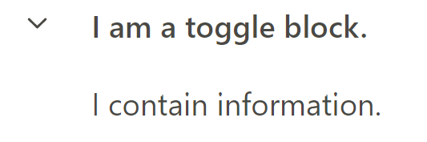
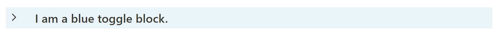
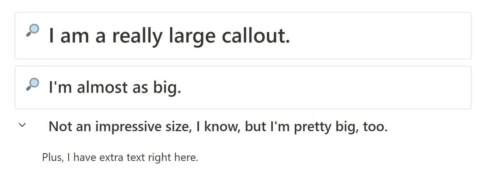

> **Based on [Notation](https://github.com/deathau/Notation-for-Obsidian) by deathau.**


<br>

>1. [Special Syntax](https://github.com/Bluemoondragon07/obsidian-notation-2/blob/main/README.md#special-syntax)
>    1. [Callout Colors](https://github.com/Bluemoondragon07/obsidian-notation-2#callout-colors)
>    2. [Toggle Blocks](https://github.com/Bluemoondragon07/obsidian-notation-2#callout-toggle-blocks)
>    3. [Heading Callouts](https://github.com/Bluemoondragon07/obsidian-notation-2#heading-callouts)
>    4. [Banner Images](https://github.com/Bluemoondragon07/obsidian-notation-2#banner-images)
>    5. [Text Classes](https://github.com/Bluemoondragon07/obsidian-notation-2#text-classes)
>2. [Some Other Cool Things](https://github.com/Bluemoondragon07/obsidian-notation-2#some-other-cool-things)
>3. [Credits](https://github.com/Bluemoondragon07/obsidian-notation-2#credits-)

<br>


**Notion** has always been one of my favourite apps because of its advanced features, and **Notation** remains one of my favourite Obsidian themes of all time. The original Notation is still a bit broken after 1.0, so I thought I'd make a new theme combining the design elements of Notation with the features of Notion. 

With Notation 2, you can experience the power of cover (banner) images, callouts with custom backgrounds, and more (see: **Special Syntax**)


# Special Syntax


## Callout Colors
Callouts are styled to look like Notion callouts by default, with a tranparent background and a faint outline. You can choose the color of any callout with ease: just add the color you want--`red`, `orange`, `yellow`, `green`, `blue`, `purple`, `pink`, `brown`, or `grey`/`gray`--inside the callout type brackets, separated by a `|`. 

> Example: `>[!quote|blue]`


## Callout "Toggle Blocks"
When I switched over to Obsidian from Notion, I found it hard to adjust to the absence of toggle blocks. So I added them to this theme.

Any collapsible callout takes on the appearance of a Notion toggle block.

### Regular Toggle Block
```markdown
>[!info]+ I am a toggle block.
>I contain information.
```




Toggle blocks also support background colors.

### Colored Toggle Block

```markdown
>[!info|blue]+ I am a blue toggle block.
>I contain information.
```



### Just...Don't Create Empty Toggle Blocks
This results in normal text with no collapse icon. 

## Heading Callouts
I made this mainly for toggles, but they work with regular callouts, too. Adding `h1`, `h2`, or `h3` inside the callout type brackets will increase the font size without messing up padding.

### Examples
```markdown
>[!info|h1] I am a really large callout.

>[!info|h2] I'm almost as big.

>[!info|h3]+ Not an impressive size, I know, but I'm pretty big, too.
>Plus, I have extra text right here.
```



## Banner Images
> **Created with the help of:** [efemkay](https://forum.obsidian.md/t/css-how-to-style-the-first-image-in-a-note/52839)


Display an image as a Notion-esque banner, or cover image, by using the css class `cover-img`. Put the image alt `banner` inside the image you want to display as the banner.

### Example:

```markdown
---
cssClass: cover-img
---


```

Also supports internal images: `![[beach.png|banner]]`.


### Modifier Alts

Add another alt, `lower` or `higher` to control the positioning of the cover image.

``

``


## Text Classes
Just like in Notion, there are three fonts to choose from for each note: Sans, Serif, and Mono.

> Note: you can also change the default global font from Style Settings.

### Serif
To use the Serif font in a note, use the css class `serif`.

```markdown
---
cssClass: serif
---
```

### Mono
To use the Monospace font in a note, use the css class `mono`.

```markdown
---
cssClass: mono
---
```

### Sans
To use Sans, the default font in a note, use the css class `sans`.

```markdown
---
cssClass: sans
---
```

## Other Classes

### `small-text`
Make the text in your note smaller.

```markdown
---
cssClass: small-text
---
```

## `wide`
Make your note full-width.

```markdown
---
cssClass: wide
---
```

# Some Other Cool Things
I tried as best as I could to mimic Notion's interface. Tags inside notes are multi-colored, Dataview tables have property icons, the backlinks block has been restyled, frontmatter looks like multi-select properties, inline dataview looks like text properties, Page Gallery plug-in looks the cards view of a database...

You can also use Notation's original color scheme (which I personally prefer over Notion's real colors) by toggling it in Style Settings.

# Credits ⭐

A huuuuge thanks to...

- deathau for the amazing Notation theme!
- efemkay for most of the banner images code - I would never have figured that out on my own!
- subframe7536 for the beautiful Maple theme, which I referenced for the colorful tags
- SIRvb for the epic ITS theme, which I referenced for the callout colors
- The developers of Obsidian - four months ago I did not know CSS, but because of your app, *now I do*. Thank you so much for this app!


